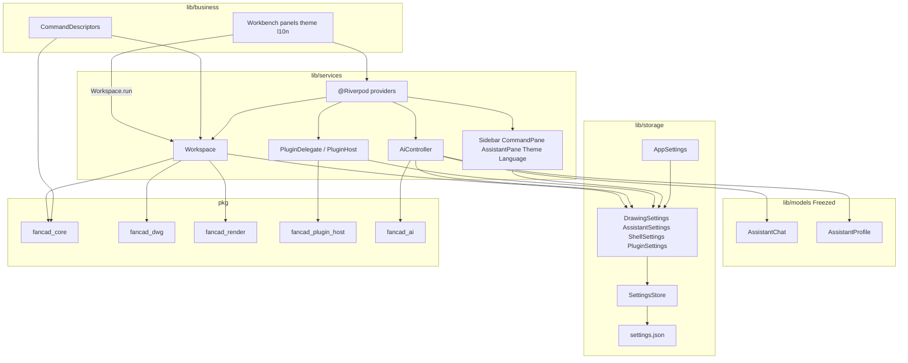
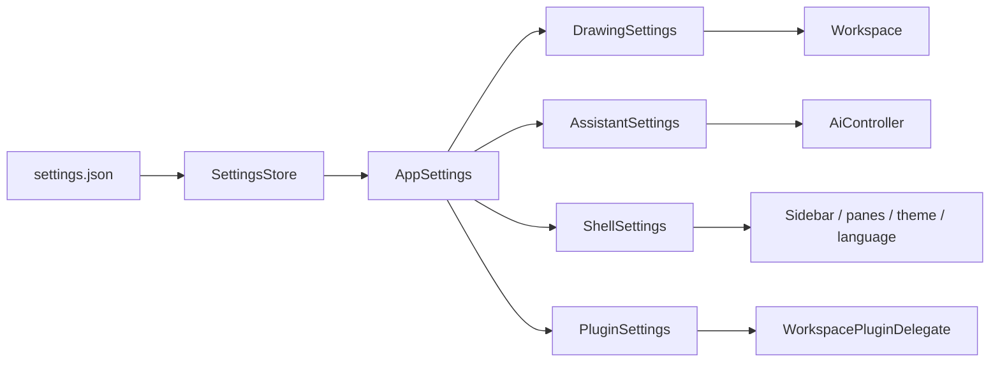
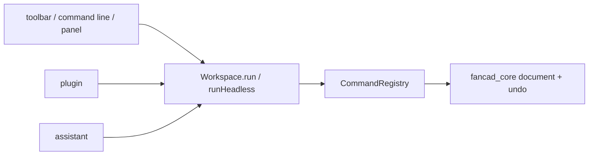

# FanCAD

[English](README.md) | [中文](README.zh.md)

An AI-native, plugin-everything 2D CAD application for the desktop, written in
Flutter.

Three ideas shape the whole design:

**The command registry is the AI tool set.** Every action — drawing a line,
changing a layer, running an extension — is a registered command with a
parameter schema. That schema is what the command palette autocompletes, what
the command line parses, and what is handed to the language model as a tool
definition. There is no separate "AI surface" to keep in sync, because there is
nothing to sync: adding a command makes it available to the user and to the
model at the same time.

**Patches are the only way to change a drawing.** The UI, extensions and the AI
agent all write through the same transaction system, so undo, change
attribution and the "preview before applying" gate work identically no matter
who initiated the edit.

**Built-in features and AI-generated features run the same code path.** The
extension API is the same whether an extension shipped with the application or
was written by the model thirty seconds ago and hot-loaded from disk.

## Status

Early. See `pkg/` for what exists; the roadmap below reflects the order things
are being built in.

## Architecture

This is a Dart workspace: one Flutter application at the root, with
product-agnostic libraries under `pkg/`. Product orchestration lives in
`lib/{models,storage,services,business}`. Dependency direction is
`business → services → (models + storage views) → SettingsStore → pkg/*`.
`pkg` must not import `package:fancad/...`.



| Layer | What lives there |
| --- | --- |
| `lib/models` | Product shapes and JSON, defined with Freezed. No disk I/O. |
| `lib/storage` | `SettingsStore` plus composed views over the same bag. No command orchestration. |
| `lib/services` | Open documents, plugin host wiring, the AI loop. Riverpod is annotated (`@Riverpod`) and generated. Services take views, not the raw store. No widgets. |
| `lib/business` | Commands, workbench, panels, theme, l10n, bundled assistant skills. Pages talk to `Workspace.run` and existing providers, not to `storage` or `FcbCache`. |
| `pkg/fancad_core` | Geometry, the document model, the transaction system, the command registry. Pure Dart. |
| `pkg/fancad_dwg` | DWG and DXF interoperability: LibreDWG shim, FCB, the disk cache. |
| `pkg/fancad_render` | The viewport: tessellation, culling, the canvas widget. |
| `pkg/fancad_plugin_host` | The extension runtime: manifests, sandboxed JavaScript, transport. |
| `pkg/fancad_ai` | Provider abstraction, the agent loop, skill registry, change approval. |

### Preferences

One `settings.json` bag. `main.dart` opens `SettingsStore`; `providers.dart`
splits it into `AppSettings`. Each service asks for the view it needs.
Drawings are not stored here: DWG/DXF go through `fancad_dwg`, and the import
cache lives in `cache/`.



### Commands

CAD verbs stay `CommandDescriptor`s in `lib/business/commands/`. They are not
rewritten as `*Services`. The UI, plugins and the model all go through
`Workspace.run` / `runHeadless`.



Nothing above `fancad_dwg` knows that LibreDWG exists; everything goes
through the `DrawingBackend` interface.

Freezed models and annotated Riverpod providers are generated. After editing
`@freezed` or `@Riverpod` sources, run `dart run build_runner build`.

## Building

```bash
flutter pub get
flutter run -d macos      # or -d windows, -d linux
```

Tests:

```bash
dart test pkg/fancad_core       # pure Dart
dart test pkg/fancad_dwg
dart test pkg/fancad_ai
flutter test                    # widget and render tests
```

Codegen, after changing a Freezed model or a `@Riverpod` provider:

```bash
dart run build_runner build
```

### DWG support is compiled from the LibreDWG submodule

DWG parsing comes from [GNU LibreDWG](https://www.gnu.org/software/libredwg/)
0.13.3, pinned as a git submodule at
`pkg/fancad_dwg/native/third_party/libredwg`. The build hook compiles it as a
static PIC library and links it into `libfancad_dwg`, so the application does
not load a Homebrew or system dylib at runtime.

Clone with submodules, or initialize them after a plain clone:

```bash
git clone --recurse-submodules <url>
# or, in an existing checkout:
git submodule update --init --recursive
```

The first build on a machine compiles LibreDWG (a few minutes). Later builds
reuse that static library. `FANCAD_LIBREDWG_ROOT` still overrides the submodule
if you are working on the parser itself.

Set `FANCAD_BUILD_VERBOSE=1` to see the full compile and link commands.

## Licence

**GPLv3.** LibreDWG is GPLv3, and FanCAD links it, so the combined work is
GPLv3. This was a deliberate choice rather than an accident of dependency
selection: the alternatives were a proprietary DWG SDK with per-seat licensing,
or writing a DWG parser from scratch. Contributors should be aware that
distributing a closed-source fork of this application is not possible while the
LibreDWG backend is linked.

The seam is `DrawingBackend` in `pkg/fancad_dwg/lib/src/backend.dart`. Nothing
above it depends on LibreDWG, so a differently licensed backend can be
substituted without touching the rest of the application.

## Roadmap

- **M0** Workspace, application shell, command registry
- **M1** Native DWG import, the document model, the render pipeline
- **M2** Transactions and undo, selection and snapping, the basic drawing and
  editing commands
- **M3** The extension host, the JavaScript API, hot reload
- **M4** The AI agent, document context, the approval gate, AI-authored
  extensions
- **M5** Professional fidelity: SHX fonts, hatch patterns, dimensions, MText
  layout, external references, layouts and printing
- **M6** Write-back: DWG and DXF export, fidelity auditing, million-entity
  performance
