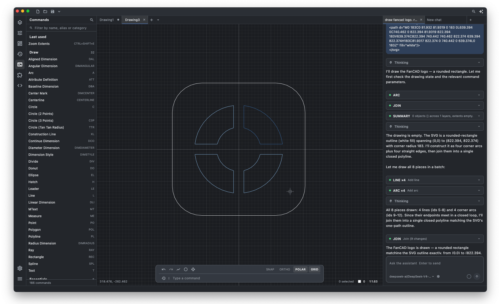

<p align="center">
  
</p>

<p align="center">
  <strong>FanCAD</strong> 是一款 AI 原生的专业 2D CAD。<br/>
  对标浩辰、中望：熟悉的 DWG 工作流，再加上一个真正能画图的助手。
</p>

<p align="center">
  <a href="https://github.com/sjjian/FanCAD/stargazers"></a>
  
  
  
  
  
</p>

<p align="center">
  
</p>

<p align="center">
  <a href="./README.md">English</a> | <b>简体中文</b>
</p>

## 为什么是 FanCAD

市面上不少「AI CAD」是在看图软件旁边挂一个对话框。FanCAD 反过来：先做专业 2D CAD，目标对齐 [浩辰 CAD](https://www.gstarcad.com/) 和 [中望 CAD](https://www.zwsoft.com/product/zwcad) 要解决的那件事——打开 DWG、画图、标注、布局、出图——再把模型放进和绘图员同一套命令里。

用过 AutoCAD 兼容软件的人，上手就该能画。区别在于：跟助手说话，也是在用这个产品。

## 核心特性

- **专业 2D CAD**：绘制、修改、标注、图层与块、图纸空间、外部参照。命令行和快捷键，就是绘图员已经在用的那些。
- **原生 DWG / DXF**：打开、交换生产图纸。不是「当图片导入」，日常文件也不锁进私有格式。
- **助手能画图**：模型调用的就是你正在用的命令。它可以画、改、查图，也能写扩展——落图之前先给你看结果。
- **你说了算**：先预览，允许或取消，整轮操作可撤销。高影响的修改不会悄悄写进图里。
- **插件即产品**：扩展是一等命令，不是旁边另开一套 API。内置、第三方、AI 刚写的插件走同一条路，保存即热重载。
- **轻量原生**：Flutter 桌面，不是 Electron，也不是套一层浏览器。Windows、macOS、Linux 原生；中英界面。
- **完全开源**：GPLv3。DWG 能力来自 [GNU LibreDWG](https://www.gnu.org/software/libredwg/)。

## 构建

```bash
git clone --recurse-submodules <url>
cd FanCAD
flutter pub get
flutter run -d macos      # 或 -d windows、-d linux
```

第一次构建会编译 LibreDWG（几分钟）。普通克隆之后跑 `git submodule update --init --recursive`。

## 许可

**GPLv3。** LibreDWG 是 GPLv3，FanCAD 链接了它，合在一起就是 GPLv3。只要还链着这个后端，就不能发行闭源 fork。
