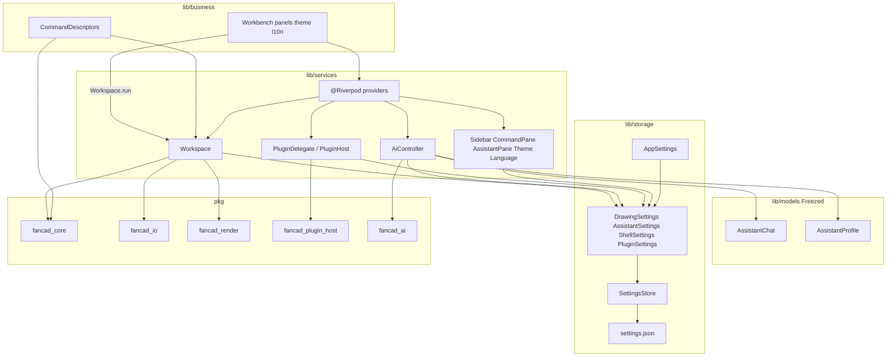
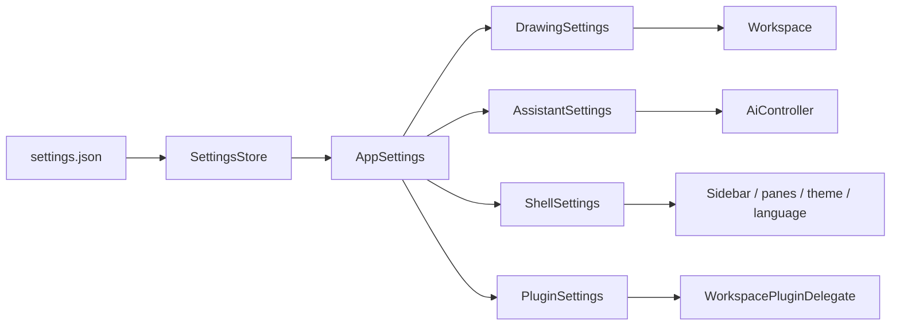
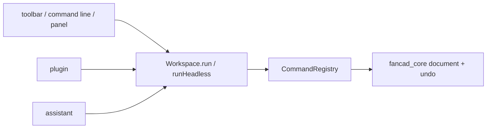

# FanCAD

[English](README.md) | [中文](README.zh.md)

面向桌面的 AI 原生、插件化 2D CAD，用 Flutter 写。

整个设计围着三件事转：

**命令注册表就是模型的工具集。** 画线、改图层、跑扩展，都是带参数 schema
的已注册命令。命令面板补全、命令行解析、交给语言模型的 tool definition，
用的是同一份 schema。没有单独的「AI 面」要同步：加上一条命令，用户和模型
同时能用。

**改图只有一条路：patch。** 界面、扩展和助手都走同一套事务，所以无论谁
发起编辑，撤销、变更归属和「先预览再应用」都一样。

**内置功能和 AI 刚写的功能走同一条代码路径。** 扩展 API 不区分随应用发布
的插件，和模型三十秒前写好、从磁盘热加载的插件。

## 现状

早期。`pkg/` 里是已经落地的部分；下面的路线图是建造顺序。

## 架构

这是一个 Dart workspace：根上是 Flutter 应用，产品无关的库在 `pkg/`。
产品编排在 `lib/{models,storage,services,business}`。依赖只朝下：
`business → services → (models + storage views) → SettingsStore → pkg/*`。
`pkg` 不得 `import package:fancad/...`。



| 层 | 放什么 |
| --- | --- |
| `lib/models` | 产品形状和 JSON，用 Freezed 定义。不碰磁盘。 |
| `lib/storage` | `SettingsStore`，以及组合同一份 bag 的 view。不做命令编排。 |
| `lib/services` | 打开文档、插件宿主、AI 循环。Riverpod 用 `@Riverpod` 注解生成。服务拿 view，不拿原始 store。不建 Widget。 |
| `lib/business` | 命令、工作台、面板、主题、文案、随包助手技能。页面只通过 `Workspace.run` 和已有 provider 做事，不碰 `storage` 或 `FcbCache`。 |
| `pkg/fancad_core` | 几何、文档模型、事务、命令注册表。纯 Dart。 |
| `pkg/fancad_io` | 开图 / 存图：DWG / DXF、LibreDWG shim、FCB、磁盘缓存。 |
| `pkg/fancad_render` | 视口：剖分、裁剪、画布。 |
| `pkg/fancad_plugin_host` | 扩展运行时：清单、沙箱 JavaScript、传输。 |
| `pkg/fancad_ai` | 供应商抽象、agent 循环、技能注册表、变更审批。 |

### 偏好设置

一份 `settings.json`。`main.dart` 打开 `SettingsStore`；`providers.dart`
拆成 `AppSettings`。每个服务只问自己那份 view。图纸不走这里：DWG/DXF 经
`fancad_io`，导入缓存在 `cache/`。



### 命令

CAD 动词仍是 `lib/business/commands/` 里的 `CommandDescriptor`，不改成
`*Services`。界面、插件和模型都走 `Workspace.run` / `runHeadless`。



`fancad_io` 之上不知道 LibreDWG 的存在，一律走 `DrawingBackend`。

Freezed 模型和注解式 Riverpod 由代码生成。改了 `@freezed` 或 `@Riverpod`
之后跑 `dart run build_runner build`。

## 构建

```bash
flutter pub get
flutter run -d macos      # 或 -d windows、-d linux
```

测试：

```bash
dart test pkg/fancad_core       # 纯 Dart
dart test pkg/fancad_io
dart test pkg/fancad_ai
flutter test                    # widget 与渲染测试
```

改了 Freezed 模型或 `@Riverpod` provider 之后：

```bash
dart run build_runner build
```

### DWG 从 LibreDWG 子模块编进来

DWG 解析来自 [GNU LibreDWG](https://www.gnu.org/software/libredwg/) 0.13.3，
钉在 `pkg/fancad_io/native/third_party/libredwg` 这个 git submodule。构建
hook 把它编成静态 PIC 库，链进 `libfancad_io`，运行时不加载 Homebrew 或
系统里的 dylib。

克隆时带上 submodule，或在已有目录里初始化：

```bash
git clone --recurse-submodules <url>
# 或在已有 checkout 里：
git submodule update --init --recursive
```

某台机器上的第一次构建会编译 LibreDWG（几分钟）。之后复用那份静态库。
自己改解析器时，仍可用 `FANCAD_LIBREDWG_ROOT` 覆盖 submodule。

`FANCAD_BUILD_VERBOSE=1` 会打出完整的编译和链接命令。

## 许可

**GPLv3。** LibreDWG 是 GPLv3，FanCAD 链接了它，合在一起就是 GPLv3。这是
有意的选择，不是选依赖时的意外：另一条路是按席收费的专有 DWG SDK，或者
从零写解析器。贡献者需要知道：只要还链着 LibreDWG 后端，就不能发行闭源
fork。

接缝是 `pkg/fancad_io/lib/src/backend.dart` 里的 `DrawingBackend`。它之上
不依赖 LibreDWG，换一个许可不同的后端不必动应用的其余部分。

## 路线图

- **M0** 工作区、应用壳、命令注册表
- **M1** 原生 DWG 导入、文档模型、渲染管线
- **M2** 事务与撤销、选择与捕捉、基础绘制和编辑命令
- **M3** 扩展宿主、JavaScript API、热重载
- **M4** AI agent、文档上下文、审批门、AI 编写的扩展
- **M5** 专业还原：SHX 字体、填充图案、标注、MText 排版、外部参照、布局与打印
- **M6** 回写：DWG / DXF 导出、保真审计、百万实体性能
